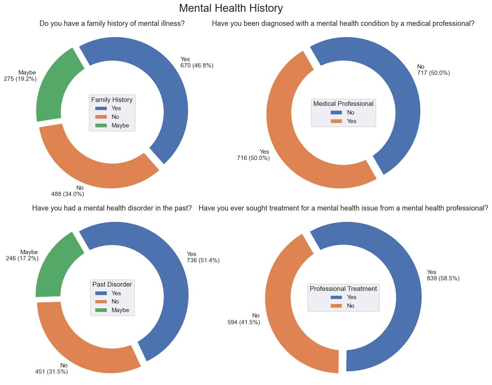

# Mental Health Analysis in Tech Industry(Data Visualization)

## Introduction

In this analysis, we delve into the mental health survey data specific to the tech industry, utilizing a wide array of data analysis tools and libraries such as Python:Pandas, Seaborn, Matplotlib, and Plotly. The dataset offers insights into employees' experiences and perceptions regarding mental health in the workplace.

Our comprehensive analysis encompassed data cleaning, feature engineering, and standardization of data values to ensure that the dataset is well-prepared for in-depth examination. We have transformed the raw data into a structured format that facilitates the extraction of meaningful insights.

To gain a deeper understanding of the survey data and reveal patterns and trends, we have employed various data visualization techniques. These visualizations provide a clear representation of the survey responses, enabling us to uncover valuable information about employees' feelings, perceptions, and experiences related to mental health issues within the tech industry.

The dataset includes a wide range of questions, covering topics such as self-employment, company size, employer-provided mental health benefits, discussions about mental health at the workplace, and individual experiences and perceptions. The data also delves into personal factors, including previous mental health history and family background.

Our analysis is aimed at shedding light on the intricate relationship between employees and mental health in the tech industry. By leveraging data analysis and visualization, we aim to uncover insights that can contribute to a more supportive and open work environment, ensuring the well-being of all employees in the industry.

Some short form explaination used in the ccolumn names:

EHC - Employer Healthcare Coverage

MH - Mental Health

PH - Physical Health

NC - Negative Consequences

PE - Previous Employer

CE - Current Employer

## Employees by Company Size:

#### Explaination:

The bar chart illustrates survey participants categorized by both company size and their affiliation with tech or non-tech sectors. Notably, in the **'more than 1000'** employee category, there's a minimal difference of 12 participants between tech and non-tech, representing the **smallest gap** across various company sizes. The '26-100' employee category boasts the **highest number** of respondents, indicating robust participation. The visualization strongly emphasizes the prevalence of participants from tech companies, with the number of tech-affiliated individuals surpassing non-tech participants by nearly **fivefold**. This data underscores the significance of the '26-100' employee category and the dominance of tech-related roles within the survey.

## Employees by Country:

#### Explaination:

The bar chart provides insights into survey participants categorized by their respective countries and their affiliation with either tech or non-tech companies. **The United States stands out as the leader in terms of participants,** with a noteworthy observation that the number of tech-affiliated respondents is approximately three times that of non-tech participants in the US. This pattern is also replicated for participants from the United Kingdom. It's important to note that the 'others' category in the visualization aggregates responses from nearly 50 countries, each with relatively low individual participation. **The lowest participant count (9) is observed in the non-tech category,** and this number is shared by Canada, Germany, and the Netherlands. Notably, the Netherlands also records the lowest number of tech participants, with only 22 individuals in this category.

## Gender Distribution:

#### Explaination:

In the donut chart illustrating the gender distribution among survey participants, it's evident that **males represent the majority at 73.8%,** followed by females at 23.7%, while the LGBTQ+ and unknown categories each constitute 1.9% and 0.6%, respectively.

The accompanying bar chart, which dissects participant gender by country, reveals a stark contrast. In the United States and Canada, the participation of females is approximately half that of males, indicating a gender disparity. Meanwhile, other countries exhibit even more substantial differences between male and female participants. Particularly striking is the UK, where **male participants significantly outnumber females by a ratio of 5 to 1.** Notably, the United States also boasts the highest number of LGBTQ+ participants at 9.

## Mental Health Illness by Remote Work Preference:

#### Explaination:

The donut chart effectively illustrates survey participants based on their remote work preferences and the presence of a current mental health issue. The majority of participants prefer **remote work 'Sometimes,' with twice as many respondents** compared to the other two preferences, 'Never' and 'Always.' Strikingly, 'Never' and 'Always' show similar participant numbers. The distribution of mental health issues among these remote work preferences appears remarkably even.

What's particularly significant is the average percentage distribution: approximately 40% affirm having a mental illness, 20-25% indicate a possibility of mental illness, and 34-38% assert they do not have a mental illness. This data strongly suggests that **remote work preferences do not significantly correlate with the presence of a mental illness,** highlighting the importance of addressing mental health comprehensively across all work arrangements.

## Mental Health Illness by Work Position

#### Explaination:

The horizontal bar chart provides a breakdown of employees with present mental illness categorized by their work positions. The responses are ordered in descending fashion, highlighting positions such as full-stack, back-end, front-end, and team leads with substantial representation.

Among full-stack developers, there is an **average count of 106** for all three response options: "Yes," "No," and "Maybe." A unique pattern emerges among back-end developers, where **61 respondents** chose "Maybe," exactly half of the count for "Yes" or "No."

Front-end developers display an interesting distribution, with the combined count of "Yes" and "Maybe" reaching 100, double the count of "No" responses. This variation in responses across different work positions demonstrates the diverse perspectives regarding mental health in the workplace.

## Mental Health History

#### Explaination:

The donut charts provide insights into various aspects of mental health history among the survey's 1433 participants, **46%** of respondents report having a family history of mental health issues, with an additional 20% remaining uncertain about their family's history in this regard.

When it comes to personal mental health experiences, **51% of participants have encountered mental health issues in the past**, while a significant 31% indicate they have not. For those diagnosed by a medical professional, there is an even split, with **50% affirming that they have been diagnosed**, and the remaining 50% have not received such a diagnosis.

In terms of seeking treatment, **58% of participants acknowledge that they have sought treatment** from a medical professional for their mental health concerns, emphasizing a proactive approach. In contrast, 41% have not pursued treatment from healthcare providers, highlighting potential areas for further support and outreach.

## Frequent Mental Health Disorders

#### Explaination:

The bubble chart effectively visualizes the prevalence of various mental health disorders among the survey participants. **Each bubble represents a specific disorder, with its size proportional to the frequency of occurrences.** Since respondents could report more than one illness, the percentages do not sum to 100%, but the legend provides the actual counts.

Notably, **mood disorders appear to be the most prevalent,** accounting for 44% of the reported cases. Anxiety disorders closely follow at 37%, indicating their substantial impact. A category referred to as "No Diagnosis" highlights cases where mental health issues were identified but could not be categorized under specific illnesses. Additionally, **ADHD is notable, constituting 12.5%** of reported occurrences, signifying its significance within the surveyed population.

## Willingness to Share Mental Health

#### Explaination:

The pie charts present a side-by-side comparison of employees' attitudes toward sharing their mental health issues with various individuals. **The distribution of responses for both sharing with coworkers and sharing with direct supervisors appears to be relatively balanced,** indicating diverse perspectives within the surveyed group. Approximately **20% of respondents are open to discussing mental health issues with coworkers,** while a slightly higher proportion, around **30%, are willing to share with their direct supervisors.**

It's worth noting that a substantial proportion, around **20%, has chosen not to provide a response** to both questions, suggesting a level of uncertainty or hesitation among this group.

Regarding sharing with family and friends, the data highlights a more positive outlook. Approximately **63% of respondents express openness to discussing mental health issues,** with the combined percentage of "very open" and "somewhat open" responses. In contrast, only **5% indicate being "not open at all"** to these conversations with family and friends.

Moreover, when it comes to doubts about discussing mental health issues, it varies across different groups. **Around 33% of respondents express doubt when sharing with coworkers, 27% with direct supervisors, and 10% with family and friends.** This insight sheds light on the varying comfort levels and perceptions of openness within different relationships and workplace dynamics.

## Employee Perspective

#### Explaination:

The side-by-side pie charts provide insights into employees' perceptions regarding discussing mental health and physical health issues in the workplace. **For mental health discussions, 49% of respondents indicate that they anticipate a negative impact ("Yes" or "Maybe"),** highlighting significant concerns surrounding the potential repercussions. In contrast, **only 22% express similar apprehension when discussing physical health issues,** signifying a substantial difference in perceived consequences between the two health domains.

Interestingly, the data reveals that **31% of respondents are confident ("No") that discussing mental health issues won't result in negative consequences,** which, while lower than the physical health category, still represents a noteworthy proportion. In the context of physical health discussions, **a majority (58%) firmly believe that no negative impact would occur.**

However, it's important to note that a notable portion of the respondents, around **20%, has not provided a response ("Not Answered")** to both the mental and physical health impact questions. This suggests a level of uncertainty or reluctance to express their views on the potential repercussions of discussing these health-related matters in the workplace.

## Mental Health Awareness by Employeer

#### Explaination:

The radar chart provides a visual representation of responses to questions related to mental health aspects in the workplace. F**or discussions initiated by the employer on mental health,** a substantial number of respondents (813) have answered "No," indicating that their employers have not formally discussed mental health as part of wellness initiatives or official communications. In contrast, 200 respondents answered "Yes," signifying that their employers have engaged in such discussions.

In terms of **resources offered by employers,** the count for "Yes" responses is 300, suggesting that a significant portion of participants acknowledge their employers providing resources for mental health support. On the other hand, 531 respondents have replied "No," indicating that their employers do not offer these resources.

Interestingly, there's a notable number of "Not Answered" responses, amounting to 287 for both employer discussions and resources offered. This could imply a lack of awareness or a degree of uncertainty regarding these aspects within the workplace.

The representation of the radar chart corresponds to specific questions:

•	**CE_Healthcare_Awareness:** 'Do you know the options for mental health care available under your employer-provided coverage?'

•	**CE_Discussed_MH:** 'Has your employer ever formally discussed mental health (for example, as part of a wellness campaign or other official communication)?'

•	**CE_Offered_Resources:** 'Does your employer offer resources to learn more about mental health concerns and options for seeking help?'

The chart's visualization highlights the diversity in responses to these critical workplace mental health-related questions.

#### Explaination:

In this pie chart, respondents' attitudes toward requesting a medical leave from work when faced with a mental health issue are represented. **There are seven equally distributed response options,** highlighting a range of sentiments on this matter.

A positive perspective is evident, with **35% of respondents finding it "Very easy" or "Somewhat easy" to request medical leave** when dealing with a mental health issue. Conversely, a notable portion of respondents (22%) holds a negative view, expressing reservations about this process.

Interestingly, around **20% of respondents have not provided a clear response,** possibly indicating uncertainty or a lack of experience with such situations. Additionally, 22% of respondents fall into a more neutral or uncertain category, suggesting a variety of perspectives on this particular aspect of managing mental health in the workplace.

The chart provides valuable insights into the diverse attitudes and comfort levels surrounding the process of requesting medical leave in the context of mental health challenges.

## Safe Environment at Workplace

#### Explaination:

**In the bar chart,** the respondents' views on the protection of their anonymity when seeking mental health or substance abuse treatment resources from their employer are portrayed. This question features four distinct responses. Strikingly, the response "Maybe" stands out with the highest count, reaching **742 respondents.** This number is approximately double that of any other response count.

Conversely, the response "No" has the lowest count, with only **84 respondents,** indicating a minority view regarding anonymity protection. Meanwhile, the "Yes" response and "Not answered" response each have an average count of **300 respondents,** suggesting a balanced distribution of opinions.

**The pie chart** represents an aggregation of responses to four related questions that delve into the issue of revealing mental health matters in different contexts, such as with clients, coworkers, and business contacts. 

The pie chart response is an amalgamation of 4 questions

•	**MH_Reveal_Clients:** If you have been diagnosed or treated for a mental health disorder, do you ever reveal this to clients or business contacts?

•	**MH_Reveal_Clients_NC:** If you have revealed a mental health issue to a client or business contact, do you believe this has impacted you negatively?

•	**MH_Reveal_Coworkers:** If you have been diagnosed or treated for a mental health disorder, do you ever reveal this to coworkers or employees?

•	**MH_Reveal_Coworkers_NC:** If you have revealed a mental health issue to a coworker or employee, do you believe this has impacted you negatively?

Astonishingly, a significant portion of respondents, approximately 82.5%, have chosen not to provide a response, suggesting a reluctance to address the topic of workplace environment safety or a lack of clarity in this area.

Out of those who did respond, **4.2% have expressed a positive viewpoint, while 2.2% are somewhat uncertain ("Maybe"),** and **7% find the question not applicable.** Furthermore, 4.1% have explicitly stated "No" regarding anonymity protection, highlighting the diverse range of perspectives within the survey population.

These findings from the bar chart and pie chart underline the prevalence of uncertainty or reticence among survey participants regarding the topic of anonymity protection in their workplace environment.

## Conclusion:

In conclusion, the visualizations have been instrumental in revealing patterns and trends, offering a clear representation of employees' experiences and perceptions related to mental health. These insights are essential for fostering a more supportive and open work environment within the tech industry.

Key findings from the visualizations include:

•	Company Size and Tech Affiliation: The '26-100' employee category shows robust participation, and tech-affiliated individuals dominate the survey, outnumbering non-tech participants by almost fivefold.

•	Country and Tech Affiliation: The United States leads in participants, with a significantly higher number of tech respondents. The gender distribution across countries shows variations, with the UK having a substantial gender disparity.

•	Mental Health Illness by Remote Work Preference: Remote work preferences do not seem to significantly correlate with the presence of a mental illness, emphasizing the need for comprehensive mental health support across all work arrangements.

•	Mental Health Illness by Work Position: Responses vary across work positions, highlighting diverse perspectives regarding mental health in the workplace.

•	Mental Health History: A substantial portion of participants has a family history or personal experience with mental health issues. Seeking treatment varies, with proactive approaches from 58% of respondents.

•	Frequent Mental Health Disorders: Mood disorders and anxiety disorders are the most prevalent, with ADHD also significant.

•	Willingness to Share Mental Health: Participants exhibit varied attitudes towards sharing mental health issues with different individuals, revealing complexities in openness and doubt.

•	Employee Perspective: While concerns about negative impacts exist for both mental and physical health discussions, the workplace environment appears to be a more significant concern regarding mental health.

•	Mental Health Awareness by Employer: The radar chart visualizes responses to key questions about employer initiatives related to mental health, reflecting diverse experiences within the workplace.

•	Requesting Medical Leave: A substantial proportion finds it easy to request medical leave for mental health issues, but a noteworthy number expresses reservations or uncertainty.

•	Safe Environment at Workplace: The response "Maybe" is the most prevalent when it comes to protection of anonymity in seeking mental health resources, highlighting concerns among employees. A significant number of respondents choose not to respond to questions about revealing mental health matters.

These insights collectively emphasize the importance of addressing mental health comprehensively and promoting a supportive and open work environment within the tech industry. By leveraging data analysis and visualization, we aim to contribute to the well-being of all employees in this field.

Please let me know what you think about this project. Thank you for reading!

Happy Coding!!!